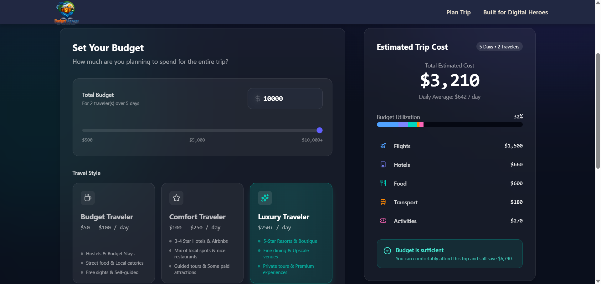

# 🌍 Budget Voyage

Budget Voyage is a smart trip-planning web application that helps travelers discover destinations and estimate travel expenses based on their budget, trip duration, and number of travelers.

Instead of manually calculating expenses for different destinations, Budget Voyage provides an instant and personalized travel plan, making budget travel planning simple and accessible.

---

## ✨ Features

- 🏖️ Browse different travel destinations
- 💰 Get trip recommendations based on your budget
- 📅 Plan trips according to the number of days
- 👥 Calculate expenses for solo or group travel
- ⚡ Instant trip cost estimation
- 📱 Fully responsive and modern user interface
- 🎯 Simple and user-friendly experience

---

## 🛠️ Tech Stack

### Frontend
- Next.js
- React.js
- TypeScript
- Tailwind CSS

### Backend
- Next.js API Routes
- Node.js

### Database
- MongoDB
- Mongoose

---

## 📸 Screenshots

### Homepage


---

### Plan Trip Page



---

### Result Page


---

## 🚀 Getting Started

### Clone the repository

```bash
git clone https://github.com/chinmay21/Budget-Voyage.git
```

### Navigate to the project

```bash
cd Budget-Voyage
```

### Install dependencies

```bash
npm install
```

### Configure environment variables

Create a `.env.local` file in the root directory:

```env
MONGODB_URI=your_mongodb_connection_string
```

### Start the development server

```bash
npm run dev
```

Open:

```text
http://localhost:3000
```

---

## 📂 Project Structure

```text
Budget-Voyage
│
├── app/
├── components/
├── model/
├── lib/
├── utils/
├── public/
│   └── asset/
├── types/
└── README.md
```

---

## 🎯 Future Improvements

- User authentication
- Save favorite trips
- Hotel recommendations
- Weather integration
- Maps integration
- AI-powered itinerary generation
- Share trip plans with friends

---

## 🤝 Contributing

Contributions, issues, and feature requests are welcome.

1. Fork the repository
2. Create your feature branch

```bash
git checkout -b feature/your-feature
```

3. Commit your changes

```bash
git commit -m "Add new feature"
```

4. Push to the branch

```bash
git push origin feature/your-feature
```

5. Open a Pull Request

---

## 📄 License

This project is licensed under the MIT License.

---

<div align="center">

### ✈️ Budget Voyage
**Plan Smart. Travel More. Spend Less.**

</div>
